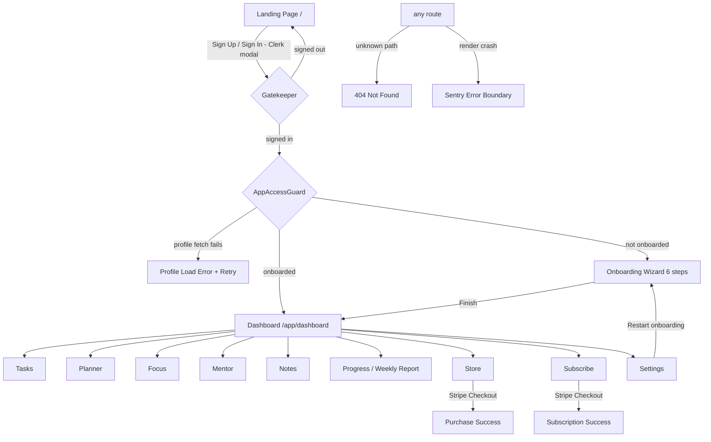

# YSC — Application Storyboard

**Version:** 1.0 · **Date:** 2026-06-10 · **Status:** Living document
**Scope:** Every stage of the shipped application, frame by frame, as actually rendered by the code on `main`/PR #9 — not an aspirational design. Each frame cites its source files so the storyboard stays verifiable.

How to read this document:
- A **Stage** is a chapter of the student's journey; a **Frame** is one screen state within it.
- Every frame lists: what the student sees (top-to-bottom), what they're trying to do, how every action is wired (API call / navigation / dialog), and the non-happy-path states the UI actually codes for.
- 🔮 marks future frames that exist in the roadmap (CURRENT_STATE.md / YSC_ROADMAP.md) but are **not built yet** — so nobody storyboards fiction into the present tense.

---

## 0. The Cast

| Persona | Need | Storyboard thread |
|---|---|---|
| **Maya, 8th grade** | "I don't know what to do first." | Landing → onboard → dashboard's top priorities → one-tap focus session |
| **Devon, 11th grade** | "I miss deadlines." | Tasks board → overdue flags → reminders bell → planner auto-suggest |
| **Priya, college freshman** | "I study but don't retain." | Notes → review cards → SM-2 queue → weekly report trend |
| **Parent/Admin** (Phase 2+) | Oversight without surveillance | 🔮 not in current UI |

---

## 1. Journey Map



Navigation chrome (always present inside `/app`): desktop sidebar with 10 items + 2 legacy tools (`AppShell.jsx`), mobile bottom nav with 5 items — Home, Tasks, Focus, Mentor, Store (`BottomNav.jsx`), header with logo, **reminders bell** (`RemindersBell.jsx`), and Clerk avatar menu.

---

## 2. Stage: Discovery (signed out)

### Frame 2.1 — Landing page `/`
*Source: `src/pages/LandingPage.jsx`, `src/components/Gatekeeper.jsx`*

**Scene, top to bottom:**
1. Nav bar — logo, anchor links (Features / Compare / Reviews / FAQ), **Sign In** + **Sign Up** buttons (Clerk modals), or **Launch App** if already signed in.
2. Hero — "Stop Drowning. Start Evolving." + primary CTA **Start Learning Free**, secondary **See Features**; three animated counters (students, words, $0 forever).
3. Trust badges (university names), six feature cards (Dictionary, Thesaurus, Pomodoro, AI Mentor, Planner, Course Packs), comparison table vs Chegg/Quizlet/Course Hero, three testimonials, four FAQ items, final CTA, footer.

**Player goal:** understand the value in <10 seconds; start free.
**Actions:** every auth CTA opens the Clerk modal (`SafeSignInButton`/`SafeSignUpButton`); anchors scroll in-page; signed-in visitors get **Launch App → `/app`**.
**States:** Clerk unconfigured → all auth buttons degrade to `/` links and `/app/*` routes refuse to render (hard-fail screen in production — the "auth is broken" walkthrough fix); signed-in variant swaps CTAs.
**Exit:** Clerk modal success → Gatekeeper redirects to `/app`.

### Frame 2.2 — The gate
*Source: `Gatekeeper.jsx`, `AppAccessGuard.jsx`*

| Condition | What renders |
|---|---|
| Clerk still loading | pulsing-orb Loading screen |
| Signed out at `/` | Landing page (plus localStorage onboarding state + Sentry user cleared) |
| Signed in at `/` | redirect → `/app` |
| Signed in, profile fetch fails | **Profile Load Error** screen with Retry button (no silent localStorage fallback) |
| Signed in, `onboarding_completed=false` | redirect → `/app/onboarding` |
| Onboarded user visits `/app/onboarding` | redirect → `/app/dashboard` |

The server (`fetchMyStudentProfile`) is the single source of truth for onboarding status.

---

## 3. Stage: Onboarding (first run)

### Frames 3.1–3.6 — The 6-step wizard `/app/onboarding`
*Source: `src/pages/OnboardingFlow.jsx`, `src/lib/onboarding.js`*

Header shows **"Step N of 6"** with a single card per step — one decision per screen (low cognitive load, <3 min target from the scope doc).

| # | Frame | Input | Validation |
|---|---|---|---|
| 1 | Grade Level | text ("11th Grade or College Freshman") | non-empty |
| 2 | Subjects | comma-separated text | non-empty |
| 3 | Weekly Goal | number, 1–80 hours | > 0 |
| 4 | Study Preferences | free text | optional |
| 5 | Timezone | text, pre-filled from the browser | non-empty |
| 6 | Semester Start | date, defaults today — "Anchors your Truth-Line" | non-empty |

**Finish:** normalizes inputs → `persistMyStudentProfile({grade_level, weekly_goal_hours, timezone, study_preferences:{subjects[], notes, semester_start_date}, onboarding_completed:true})` → success toast → `/app/dashboard` (replace).
**States:** "Loading your saved profile…" on mount (resumable — remote profile pre-fills the form); amber "Identity sync warning" banner if user resolution fails; Finish shows "Saving…" and disables while busy.

---

## 4. Stage: The Daily Loop

### Frame 4.1 — Dashboard `/app/dashboard`
*Source: `src/pages/Dashboard.jsx`, `TruthLine.jsx`*

```
┌──────────────────────────────────────────────────┐
│ TODAY VIEW · Student Dashboard                   │
│ ┌──────────────────────────────────────────────┐ │
│ │ Truth-Line: W1 ▓▓▓▓ [W9·Current] ░░ Mid Final│ │
│ └──────────────────────────────────────────────┘ │
│ [ + Add Task ] [ ▶ Start Focus ] [ 💬 Ask AI ]   │
│ ┌────────────┐ ┌────────────┐ ┌────────────┐    │
│ │Completion %│ │ Streak 🔥  │ │ Overdue ⚠  │    │
│ └────────────┘ └────────────┘ └────────────┘    │
│ ───────────── progress bar ──────────────────    │
│ ┌─ Active Tasks ──────┐ ┌─ Upcoming Blocks ───┐ │
│ │ • task (due, prio) →│ │ • block (start) →   │ │
│ │ [Open Task Manager] │ │ [Open Planner]      │ │
│ └─────────────────────┘ └─────────────────────┘ │
└──────────────────────────────────────────────────┘
```

**Player goal:** know what to do *right now* in ≤2 taps.
**Data:** `fetchTaskStats()` (completion %, streak, overdue), `fetchTasks(active, limit 5)`, `fetchMyStudentProfile()` (semester week for Truth-Line), `fetchBlocks(next 48h, limit 4)` — profile and planner fetches are best-effort so the dashboard never hard-fails on them.
**States:** spinner while loading; red error banner; Truth-Line empty state links to Settings when no semester date; "No active tasks. Great job!"; "Nothing scheduled in the next 48 hours."
**Exits:** quick actions → Tasks / Focus / Mentor; task rows → `/app/tasks`; block rows → `/app/planner`.

### Frame 4.2 — Task board `/app/tasks`
*Source: `src/pages/TaskManager.jsx`*

**Scene:** four-column kanban — **Not Started / In Progress / Submitted / Completed** — with per-column counts; header has **Filters** (priority, subject) and **New Task**.
**Card anatomy:** title + priority badge; overdue cards get red border + "Nd overdue"; due date, estimate, subject; **advance-status** button (→ next pipeline stage) and delete.
**Actions:** New/edit dialog (title*, description, priority, subject via `SubjectPicker` with inline create, due date, estimate) → `createTask`/`updateTask`; advance → `patchTaskStatus`; delete → confirm dialog → `deleteTask`. Completing a task feeds the dashboard stats, the weekly report, and stops its reminders at next sync.
**States:** loading spinner; dismissible error banner; per-column "No tasks" dashed cards; saving spinners in dialogs.

### Frame 4.3 — Study planner `/app/planner`
*Source: `src/pages/StudyPlanner.jsx`*

**Scene:** week header ("N blocks · X h planned"), **Auto-Suggest** + **New Block** buttons; week navigator (‹ date-range, Today, ›); seven day columns (Mon–Sun), today highlighted, each with a per-day **+** and block cards (complete-circle, title, time range, goal, subject badge, "suggested" badge for auto-suggested blocks, delete).
**The signature beat — Auto-Suggest:** button → `GET /api/planner/suggest` (due-soon assignments without a future block → proposed blocks at 5 pm in the student's timezone, staggered, never in the past) → checkbox dialog, all pre-checked → **Add Selected** → `POST /api/planner/blocks/bulk` → toast + grid refresh. Zero suggestions → informational toast ("Add assignments with due dates…").
**Other actions:** New Block dialog (title*, goal, day select limited to the visible week, start time, duration preset 25/45/60/90/120, subject) → `createBlock`; circle → `completeBlock` toggle; trash → `deleteBlock`.
**States:** loading spinner; "Free" dashed cards on empty days; completed blocks go green with strikethrough.

### Frame 4.4 — Focus mode `/app/focus`
*Source: `FocusPage.jsx`, `FocusMode.jsx`, `FocusStats.jsx`*

**Scene (page):** "Start a Session" card with **Focus Mode** button + lifetime stats card (total minutes, sessions, hours — hidden until the first minute is banked).
**Scene (overlay):** full-screen takeover — total-minutes badge, MM:SS countdown from 25:00, progress bar, Pause/Resume; **exit (X) only appears while paused** — a deliberate friction beat; Escape while running just toasts "Stay focused!".
**Lifecycle wiring:** start → `createStudySession(pomodoro, 25)`; complete → `completeStudySession` + `createFocusLog(25)` + celebratory toast; early exit with >0 elapsed minutes → partial session saved the same way ("Partial session saved: X minutes"). One-time localStorage → server minutes migration runs on mount (`legacyImportFocusMinutes`, idempotent 409 on repeat).
**Feeds:** weekly report focus minutes, dashboard streak context, FocusStats.

### Frame 4.5 — Notes & review cards `/app/notes`
*Source: `src/pages/NotesPad.jsx`*

**Tab 1 — Notes:** search input (300 ms debounce → server-side title/content search), **Show Archived** toggle, **New Note**; tag chips row (click to filter, click again to clear); note-card grid (title, 3-line preview, subject, tag badges, updated date) with per-card actions: **Make card**, archive/restore, delete (confirm dialog warns linked cards go too).
**Tab 2 — Review Cards** (badge shows due count):
```
┌─ Review 2 of 5 ────────────────────────────┐
│  Front: "What organelle runs photosynthesis?" │
│  [ Show Answer ]                            │
│  …flips to…                                 │
│  Back: "The chloroplast."                   │
│  [Again] [Hard] [Good] [Easy]               │
└────────────────────────────────────────────┘
  All cards (N): front/back previews, review
  count, next-review date, delete
```
**Review wiring:** each rating → `POST /api/notes/cards/{id}/review` → **SM-2** scheduling (lapses re-queue in 10 minutes; successes run 1 → 6 → interval×ease days). Queue is served oldest-due-first by the API. Finishing the queue → "Review session complete!" toast.
**Create paths:** New Card dialog (front*, back*, optional linked note) or **Make card** from a note (front pre-filled with title, back with content).
**States:** per-tab loading spinners; search-empty vs no-notes-yet empty states; "All caught up — no cards due."

### Frame 4.6 — The Mentor `/app/mentor`
*Source: `MentorPage.jsx`, `TheMentor.jsx`, `useElevenLabs.js`*

**Scene:** header with animated orb (pulses while the AI speaks) + status dot (red speaking / green listening / yellow packs-unlocked / gray default); voice controls — mic mute (during session), start/end voice session, volume; unlocked-pack badges; scrollable chat (user right/blue, mentor left/gray) with typing dots and a speaking-equalizer; textarea + Send (Enter sends, Shift+Enter newline).
**Text beat:** send → `sendMentorChat(message, history, unlocked_packs, user_id)` → reply appended; last 50 messages persist in localStorage.
**Voice beat:** phone button → ElevenLabs Conversational AI session (`@elevenlabs/react`); live transcript replaces local messages during the session; transcript persisted via `persistVoiceTranscript` on end (best-effort).
**Error frames (each explicitly coded):** mic permission denied (amber, settings link) · quota exceeded (red, **Upgrade plan** → store) · network/timeout (red, **Retry**) · unknown (red). Guardrail framing ("coach, don't cheat") lives in the backend prompt.

### Frame 4.7 — Reminders bell (header, every `/app` screen)
*Source: `RemindersBell.jsx`*

**Scene:** bell icon with unread-count badge (9+ cap). Open → popover: "Reminders" header + **Mark all read**; rows with type icon (⏰ due_soon amber · ⚠ overdue red · 📅 study_block accent · 🔄 weekly_reset blue), title, message, relative time, unread dot.
**Wiring:** mount/open → `POST /api/reminders/sync` (derives due-soon ≤24 h, overdue, study-block ≤60 min reminders from live data; idempotent — no duplicate spam) then `GET /api/reminders`; the badge count is a dedicated full-table unread count, not the visible page. Row click → mark read; all failures are silent (the bell is chrome — it must never break the shell).

---

## 5. Stage: Reflection & Growth

### Frame 5.1 — Weekly report `/app/progress`
*Source: `src/pages/WeeklyReport.jsx`*

**Scene:** "Week of Jun 8 – Jun 14" header + **Save Snapshot**; four summary cards (Tasks Completed ✓ · Focus Minutes ⏱ · Top Subject 📖 · Missed ⚠); two-panel row — **This Week, Day by Day** (Recharts composed chart: focus-minute bars + tasks-completed line) and **Next Week Plan** (count of assignments due next week + top-3 priorities by urgency, CTAs → Planner and Mentor); study-block follow-through strip (completed/scheduled + %); **Week-over-Week Trend** line chart from saved snapshots.
**Wiring:** `GET /api/reports/weekly/current` (computed live) + `/history`; **Save Snapshot** → `POST /generate` (idempotent upsert per user+week).
**States:** loading; error banner; trend locked behind "your first two saved weeks unlock this chart"; encouraging empty next-week copy.

---

## 6. Stage: Commerce

### Frames 6.1–6.4 — Store `/app/store(/:degreeSlug)`
*Source: `StorePage.jsx`, `StoreBrowser.jsx`, `DegreeSelector.jsx`, `LevelSelector.jsx`, `PackDetail.jsx`, `PurchaseSuccess.jsx`*

A three-beat funnel, deep-linkable at every beat:
1. **Degree selection** — list from `fetchDegreePlans()`; choosing navigates to `/app/store/{slug}`.
2. **Pack grid** — packs for the degree (`fetchDegreePacks`); owned packs show **Unlocked**.
3. **Pack detail** — description, features, price → **Checkout** → `createCheckoutSession` → **redirect to Stripe Checkout** (off-app) → return URL carries `?checkout=success|cancel&pack=…`.
4. **Success** — `PurchaseSuccess` banner, purchases context refreshes (pack instantly unlocked across Mentor/content), **Continue** resets to degree selection.

**States:** loading per beat; degree/purchase error cards; cancel returns silently to the same pack; subscription-aware gating (active subscribers see covered packs as unlocked).

### Frames 6.5–6.6 — Subscribe `/app/subscribe`
*Source: `SubscribePage.jsx`, `SubscriptionPlans.jsx`, `TierCard.jsx`, `CurrentSubscriptionBanner.jsx`, `SubscriptionSuccess.jsx`*

**Scene:** "Pick your plan" + *14-day free trial* subtitle; monthly/annual toggle; two tier cards — **Degree Bundle** ($7.99/mo · $79.99/yr, requires picking a degree from a dropdown) and **All Access** ($14.99/mo · $149.99/yr, highlighted) with annual-savings callouts; existing one-time-pack owners see a banner acknowledging their packs.
**Wiring:** Subscribe → `createSubscriptionCheckoutSession({tier, cadence, degree_plan_id})` → Stripe → `?checkout=success` → success view + subscription context refresh. Degree Bundle without a degree selected → validation toast. Active subscribers see `CurrentSubscriptionBanner` (status + billing portal entry).

---

## 7. Stage: Self-Service

### Frame 7.1 — Settings `/app/settings`
*Source: `src/pages/UserSettings.jsx`*

**Scene:** three cards —
1. **Profile:** display name, grade, school, major, year (select), timezone (9 US zones), weekly goal (1–168 h), semester start date, study-preferences notes → **Save Profile** (merge-aware save that preserves nested `study_preferences` keys it doesn't own).
2. **Subjects:** rows with color swatch, inline rename, per-subject task count, archive (confirm dialog) / restore, collapsible archived list, add-subject form with color palette. Optimistic updates with rollback on failure.
3. **Account:** **Restart Onboarding** → flips `onboarding_completed=false` → `/app/onboarding`.

### Frame 7.2 — Legacy tools (`/app/legacy`, `/app/search`, `/app/shifter`)
*Source: `HomePage.jsx`, `SearchPage.jsx`, `ShifterPage.jsx`*

The original four-tab hub survives at `/app/legacy` (Search / Shifter / Store / Mentor in tabs); Search (Free Dictionary API lookups + recent-search history in localStorage) and the Context Shifter (academic-register rewriter) also live as sidebar "Legacy Tools". Kept until their audiences migrate; candidates for consolidation.

---

## 8. Stage: When Things Go Wrong

| Frame | Trigger | What the student sees | Source |
|---|---|---|---|
| 404 | unknown route | compass icon, "Page not found", the bad path in a code block, **Go to Dashboard** (signed in) / **Back to Home** | `NotFoundPage.jsx` |
| Crash | render exception | Sentry error boundary: "Something went wrong… our team has been notified" + **Try again** | `App.js` `GlobalErrorFallback` |
| Auth config missing (prod) | no Clerk key | "Sign-in is temporarily unavailable" — `/app/*` never renders unguarded | `App.js` |
| Profile fetch failure | backend down at gate | Profile Load Error + **Retry** | `AppAccessGuard.jsx` |
| API failure inside a page | any fetch rejects | toast with reason + inline error banner; bell fails silent | per page |
| Build missing env vars | CI/Vercel | build aborts loudly listing each missing `REACT_APP_*` var | `scripts/check-env.js` |

---

## 9. Cross-Cutting Design Language

- **Layout chrome:** desktop = sticky header + left sidebar (10 nav items + legacy tools); mobile = header + 5-item bottom nav with safe-area inset. Content column max-w-7xl.
- **State conventions:** spinner = `Loader2` accent; errors = red/10 banner with dismiss; empty = dashed-border card with action-oriented copy; success/destructive actions always toast (sonner, top-center).
- **Color voice:** dark navy base (`hsl(217 64% 11%)`), mint accent (`hsl(166 100% 70%)`), priority palette (slate/blue/amber/red), status palette (emerald done, red overdue).
- **Copy voice:** 8th–9th grade readability, action-first ("Do next step now"), never shaming ("No active tasks. Great job!").
- **Dialogs:** create/edit are modal with disabled-while-saving primaries; destructive actions always get a confirm dialog naming the thing being deleted.

---

## 10. 🔮 Future Frames (roadmap-mapped, not yet built)

| Future stage | Roadmap ref | Storyboard stub |
|---|---|---|
| Placement exams: catalog → attempt → scoring → results | Step 7 (7.3+) | exam list per state/grade → free-sample preview → timed attempt UI → score + answer review |
| Team messaging board | Step 6 | real-time channel per cohort, entitlement-gated |
| Admin content authoring | Step 8 | CRUD over `content_items` + prompt templates + feature flags |
| Email reminders + weekly reset email | Step 10 (Resend) | weekly_reset reminder type already exists in the data model; bell already renders it |
| AI note summarization in NotesPad | Module F stretch | "Summarize with Mentor" action on a note (rate-limited) |
| PWA install + offline shell | Step 11 | install prompt frame; offline banner |

---

*Maintenance rule: when a frame changes in code, update its section in the same PR. Frames must cite real files. The storyboard is part of the definition of done for UI-facing work.*
