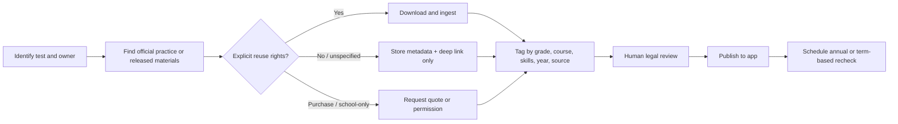

# Official Study Material Source Map for Admissions and State Tests

## Executive summary

For a study app, the safest starting point is **not** to ingest everything you can access on the web. The strongest pattern across official sources is that many materials are **publicly viewable but not openly licensed**. That is especially true for vendor-owned admissions tests such as **HSPT, ISEE, SSAT, ACT, AP, NNAT, OLSAT, and CogAT**, where providers either explicitly restrict copying/reproduction or make full materials available only to schools, qualified users, or authorized AP teachers/students. Pearson and Riverside both publish permission/licensing workflows for reproductions, College Board requires copyright/trademark permission requests for commercial or test-prep use, ACT states that site content is copyrighted, and STS treats HSPT as a secure school-purchase product with restrictive permissions. citeturn35search0turn35search1turn35search2turn35search10turn36search1turn36search8turn16search14turn16search16turn15search0turn3view0

The **best official ingestion targets** are the state and district programs that publish **released items, public practice tests, guidance PDFs, blueprints, or item samplers** on their own websites. The strongest examples in this research set are **STAAR, SOL, LEAP 2025, Wisconsin Forward, SHSAT, Regents, Florida FAST/EOCs, MCAP, PSSA item samplers, and many CAASPP/CAST resources**. These are usually free and built for students, educators, or families, but most still do **not** show an open or Creative Commons license on the cited page, so a commercial app should generally **link out or request permission before mirroring/adapting**. citeturn40view0turn40view1turn29search1turn37search3turn18search2turn18search1turn22search7turn39search8turn38search4turn13search14

A second pattern is that several tests on your list either **do not have a public official practice bank** or only have **orientation/tutorial content**, not reusable item pools. That is true for **CPS HSAT**, public-facing **HSPT**, and many church-administered admissions programs. In those cases, the practical app strategy is to store **metadata + deep links + test specs/FAQs**, then build **original, non-infringing practice items** mapped to official domains and public blueprints rather than copying official prompts. citeturn40view3turn1view0turn2view1turn19search2turn18search10

The minimal product recommendation is straightforward: keep a **license-aware content registry**, default to **link-out for copyrighted official content**, ingest only materials with clear reuse rights or written permission, and add **versioning + provenance metadata** so you can recheck official resources each school year. That approach is especially important because many key pages are updated annually, including SHSAT admissions guides, Regents scoring pages, Boston Exam Schools admissions use of MAP Growth, Florida released item files, and Louisiana practice libraries. citeturn18search2turn18search3turn40view4turn22search1turn29search1

## Legal and integration guidance

The most defensible default for an app like yours is:

- **Mirror only** content that is expressly open, expressly redistributable, or covered by written permission.
- For **public but copyrighted** materials, store metadata and deep links, not copied question stems.
- For **secure or school-only** products, use official descriptions, blueprints, and practice access instructions, then create your **own original items** aligned to the official skill domains.
- For teacher-gated systems such as **AP Classroom** and school-licensed systems such as **MAP Growth**, treat them as **integration targets you reference**, not content sources you scrape. citeturn16search1turn16search5turn16search16turn17search2turn35search10turn36search8turn15search0turn3view0

A practical legal checklist for each file should record:

| Field | Why it matters |
|---|---|
| `source_owner` | Who owns the content and who can grant permission |
| `official_url` | Canonical page to revisit for updates |
| `resource_url` | Direct file/portal link used by the app |
| `format` | PDF, HTML, portal, item bank, video, DOCX, audio |
| `access_model` | Public, login-gated, school-only, qualified-user-only |
| `license_status` | Open / public-but-unspecified / permission required / purchase required |
| `redistribution_allowed` | Yes / no / unspecified |
| `adaptation_allowed` | Yes / no / unspecified |
| `version_or_year` | Annual updates are common in testing |
| `grade_or_course` | Needed for routing and indexing |
| `skills_tags` | Needed for search, sequencing, analytics |
| `jurisdiction` | State, district, archdiocese, national |
| `language` | Important for bilingual or translated releases |
| `answer_key_or_rubric` | Controls feedback generation |
| `retrieved_at` and `last_reviewed_at` | Compliance and update hygiene |
| `permission_contact` | Fast escalation for licensing requests |

That schema is worth implementing **before** bulk ingestion, because the rights picture is much more important here than the raw file count. citeturn35search1turn35search4turn36search1turn16search14turn15search1turn3view1

### Content acquisition workflow

## National and multistate tests

| Test | Official owner and site | Direct practice / specs links | Formats | License / usage summary | Paywall | Contact | Sources |
|---|---|---|---|---|---|---|---|
| HSPT | Scholastic Testing Service / [HSPT official](https://www.ststesting.com/hsp/index.html) | [Parent page](https://ststesting.com/hspt/); [Preview request](https://ststesting.wordpress.com/high-school-placement-test-preview-request/) | HTML / web form | **No public official practice form for families found.** STS describes HSPT as a secure, annually renewed school lease/score program; preview sample is limited to high schools. STS also publishes a permissions process. Treat as **permission-required**. | **Yes** — school purchase/lease; public pricing not listed | STS contact form; **1-800-642-6787**; **1-630-766-7150** | citeturn1view0turn2view1turn3view0turn3view1turn3view2 |
| ISEE | ERB / [ISEE preparation hub](https://www.erblearn.org/families/isee-preparation/) | “What to Expect” guides: [Lower PDF](https://cdn.erblearn.org/www/20210712_ERB_ISEE_What_To_Expect_Guide_Lower-Level.pdf), [Middle PDF](https://cdn.erblearn.org/www/20210712_ERB_ISEE_What_to_Expect_Guide_Middle-Level.pdf), [Upper PDF](https://cdn.erblearn.org/www/20210712_ERB_ISEE_What_to_Expect_Guide_Upper-Level.pdf); free online sample tests via ERB linked on hub | PDF / interactive web | Free official sample tests and guides are public. ERB site footer states **copyright/all rights reserved**; no open reuse license surfaced. Use as **link-out or permissioned content**, not mirrored commercial content. | **Mixed** — free official samples; premium prep via Test Innovators partner | **iseeoperations@erblearn.org**; **1-800-446-0320** | citeturn4view0turn4view2 |
| SSAT | Enrollment Management Association / [Official SSAT practice](https://www.ssat.org/prepare/practice) | [Free mini-test](https://portal.ssat.org); [Elementary guides page](https://www.ssat.org/about/school-level/elementary-level-ssat); [Guide book preview PDF](https://cdn2.hubspot.net/hubfs/5232910/SSAT/ULTOG_WhatsInside.pdf) | HTML / portal / PDF | Free mini-test + free elementary guides are public; Middle/Upper official prep is sold. No open license surfaced; treat as copyrighted, **no redistribution absent permission**. | **Yes** — guide books **$70**, online practice **$80**, bundle **$130**; free mini-test/elementary PDFs available | Help Center via SSAT site | citeturn1view2turn6view0turn6view1turn6view2turn7view0 |
| CLT | Classic Learning Initiatives / [CLT practice hub](https://www.cltexam.com/tests/practice-test/) | [CLT practice page](https://www.cltexam.com/tests/practice-test/); [Example test page](https://www.cltexam.com/tests/example-test/); [CLT sample PDF](https://info.cltexam.com/hubfs/Sales/Sample%20Tests/CLT%20Sample%20Test.pdf); [CLT10 sample PDF](https://info.cltexam.com/hubfs/Sales/Sample%20Tests/CLT10%20Sample%20Test.pdf); [Student guide page](https://www.cltexam.com/tests/student-guide/) | HTML / PDF / account-based practice | CLT offers free account-based practice tests and public sample PDFs for several levels. Paid student guide adds more tests. Terms of use apply; no open reuse permission surfaced. | **Mixed** — free practice/account; paid student guide | CLT contact page on official site | citeturn10view0turn10view1turn1view3turn9search3turn9search4 |
| ACT | ACT / [Free ACT prep hub](https://www.act.org/content/act/en/products-and-services/the-act/test-preparation/free-act-test-prep.html) | [Preparing for the ACT PDF](https://www.act.org/content/dam/act/unsecured/documents/Preparing-for-the-ACT-e.pdf); [Practice Test 2 PDF](https://www.act.org/content/dam/act/unsecured/documents/ACT-Test-Prep-ACT-Practice-Test-2-Form.pdf); [Sample questions](https://www.act.org/content/act/en/products-and-services/the-act/test-preparation/free-act-test-prep/act-online-test-sample-questions.html); [Writing samples](https://www.act.org/content/act/en/products-and-services/the-act/test-preparation/writing-sample-essays.html) | PDF / HTML / interactive web | ACT provides substantial free official prep, but ACT’s terms state site content is copyrighted. Safer commercial pattern: **link and tag**, not mirror. Optional paid prep exists; fee-waiver users receive free self-paced access. | **Mixed** — free official practice; optional premium prep | [ACT contact](https://www.act.org/content/act/en/contact-act.html) | citeturn11search0turn11search4turn11search7turn11search10turn11search17turn15search0turn15search1turn15search15turn14search8 |
| AP Exams | College Board / [AP](https://ap.collegeboard.org/) and [AP practice hub](https://apstudents.collegeboard.org/ap-exams-what-to-know/practice-for-exams) | [Practice for AP Exams](https://apstudents.collegeboard.org/ap-exams-what-to-know/practice-for-exams); [AP Courses & Exams index](https://apcentral.collegeboard.org/courses); example course pages with FRQs such as [AP World History exam page](https://apstudents.collegeboard.org/courses/ap-world-history-modern/assessment) and [APUSH exam page](https://apstudents.collegeboard.org/courses/ap-united-states-history/assessment); example CED PDF: [AP U.S. Government CED](https://apcentral.collegeboard.org/media/pdf/ap-us-government-and-politics-course-and-exam-description.pdf) | HTML / PDF / teacher-gated question bank | Public FRQs and CEDs are useful for indexing, but **AP Classroom/AP Question Bank are restricted to authorized schools/teachers/students**. College Board has explicit permissions processes, including for commercial use. | **Mixed** — many public FRQs/CEDs free; AP Classroom is school-authorized, not open | AP Services for Students **888-225-5427**; Educators **877-274-6474** | citeturn11search1turn11search11turn11search14turn14search1turn14search3turn14search10turn16search1turn16search5turn16search11turn16search14turn16search16 |

## State and regional tests

| Test | Official owner and site | Direct practice / specs links | Formats | License / usage summary | Paywall | Contact | Sources |
|---|---|---|---|---|---|---|---|
| CAASPP / Smarter Balanced | California Department of Education / [CAASPP home](https://www.cde.ca.gov/Ta/tg/ca/) | [Available resources by test](https://www.cde.ca.gov/ta/tg/ca/catestingresources.asp); [Parents resource page](https://www.cde.ca.gov/ta/tg/ca/caasppparentresource.asp); [Training/Practice/Interim at-a-glance PDF](https://www.cde.ca.gov/TA/TG/sa/documents/tt-pt-ia-glance.pdf) | HTML / PDF / portal-linked | Public state resources; the cited pages do **not** show an open/CC license. Good for link-out and metadata, but obtain permission before mirroring in a paid app. | **No** for public materials | Not listed on cited resource pages | citeturn13search5turn13search8turn13search11turn11search9turn13search14 |
| CAST | California Department of Education / [CAST overview](https://www.cde.ca.gov/ta/tg/ca/caasppscience.asp) | [CAST practice/training PDF](https://www.cde.ca.gov/ta/tg/ca/documents/castpracticetraining.pdf); [CAST IAs, practice, training PDF](https://www.cde.ca.gov/ta/tg/ca/documents/castiaprtr.pdf); [CAST training/practice/interim PDF](https://www.cde.ca.gov/ta/tg/ca/documents/casttrainingpractice.pdf) | PDF / HTML | Publicly posted state guidance and practice-support docs; no open license surfaced. | **No** | Not listed on cited resource pages | citeturn13search0turn13search3turn13search6turn13search9turn13search16 |
| NNAT | Pearson / [NNAT3 product page](https://www.pearsonassessments.com/en-us/Store/Professional-Assessments/Cognition-%26-Neuro/Naglieri-Nonverbal-Ability-Test-%7C-Third-Edition/p/100001822) | Public official support/docs only: [NNAT3 support hub](https://support.pearson.com/usclinical/s/topic/0TO0N000000QghZWAS/nnat3) | HTML / support docs | Pearson restricts reproductions and routes permission/licensing through formal forms; NNAT3 online use is by limited, non-exclusive license. I did **not** find a public official released-item bank in this pass. | **Yes** — school / qualified-user purchase | Pearson customer support **800-627-7271**; permissions via **pas.licensing@pearson.com** | citeturn32search0turn32search3turn34search0turn35search0turn35search1turn35search2turn35search10 |
| OLSAT | Pearson / [OLSAT 8 product page](https://www.pearsonassessments.com/en-us/Store/Professional-Assessments/Academic-Learning/Otis-Lennon-School-Ability-Test-%7C-Eighth-Edition/p/100000003) | Official district implementation example: LAUSD [OLSAT resources](https://gate.lausd.org/apps/pages/index.jsp?pREC_ID=2641978&type=d&uREC_ID=4408943) with required practice test notice | HTML / web portal | Pearson licensing/permissions govern copying; I did **not** find a Pearson-hosted public released-item bank in this pass. LAUSD shows official district-administered practice access for families, but that does not create a redistribution license for your app. | **Yes** — school / qualified-user purchase | Pearson customer support **800-627-7271** | citeturn32search1turn32search4turn34search0turn35search0turn35search1turn35search2 |
| CogAT | Riverside Insights / [CogAT page](https://riversideinsights.com/k12-assessments/cogat) | [CogAT overview brochure PDF](https://riversideinsights.com/hubfs/CogAT/CogAT%20Overview%20Brochure.pdf?hsLang=en); [Store page with pricing](https://store.riversideinsights.com/shop/the-cognitive-abilities-test); [Teacher handouts/resources hub](https://learning.riversideinsights.com/courses/CogAT-datamanager-knowledge-hub) | PDF / store / learning portal | Riverside publishes sample items in brochure form, but also states unauthorized copying/distribution of testing materials is copyright infringement and provides a permissions form. | **Yes** — school purchase; some online forms listed around **$18.50** on store page | **permissions@riversideinsights.com**; general inquiries **inquiries@service.riversideinsights.com**; **800-323-9540** | citeturn33search0turn33search1turn33search3turn36search1turn36search4turn36search6turn36search8 |
| FSA / B.E.S.T. / FAST | Florida Department of Education / [Florida Statewide Assessments Portal](https://flfast.org/index.html) | Example current released items: [Grade 6 FAST ELA Reading PDF](https://flfast.org/content/contentresources/en/2024%20Test%20Release%20Support%20Document%20Practice%20Test%20Reading%20Grade%206_508.pdf), [Grade 3 FAST Math PDF](https://flfast.org/content/contentresources/en/2024%20Test%20Release%20Support%20Document%20Practice%20Test%20Math%20Grade%203_508.pdf) | Portal / PDF | Florida says released tests are for transparency and familiarization. Publicly posted; no open/CC license surfaced. Treat as linkable public resources, not assumed-redistributable commercial assets. | **No** for public files | Portal “Contact Us” present; specific contact details not surfaced in this pass | citeturn22search7turn22search9turn22search13turn22search1 |
| PERT | Florida Department of Education / [PERT overview](https://www.fldoe.org/schools/higher-ed/fl-college-system/academics/common-placement-testing.stml) | [PERT study guide PDF](https://www.fldoe.org/core/fileparse.php/7533/urlt/pert-studentstudyguide.pdf); [PERT FAQ PDF](https://www.fldoe.org/core/fileparse.php/5592/urlt/0078246-pertfaq.pdf); [PERT diagnostic manual PDF](https://www.fldoe.org/core/fileparse.php/5592/urlt/0078247-pertdiagnosticmanualv1.pdf) | PDF / HTML | Excellent official prep/support docs are public. The study guide itself carries a McCann “All Rights Reserved” notice; no reuse grant surfaced. | **No** for guides; live testing fees vary by institution | PERT repository/login exists; no dedicated current public permissions contact surfaced in this pass | citeturn23search2turn23search7turn23search9turn23search12turn23search15 |
| Florida EOCs | Florida Department of Education / [Florida Statewide Assessments Portal](https://flfast.org/index.html) | [Algebra 1 EOC released-items PDF](https://flfast.org/content/contentresources/en/2024%20Test%20Release%20Support%20Document%20Practice%20Test%20Algebra%201.pdf); [Geometry EOC released-items PDF](https://flfast.org/content/contentresources/en/2025%20Test%20Release%20Support%20Document%20Practice%20Test%20Geometry_508.pdf); [Civics sample materials PDF](https://flfast.org/content/contentresources/en/CIV_STM_508.pdf); [Civics released-items PDF](https://flfast.org/content/contentresources/en/2024%20Test%20Release%20Support%20Document%20Practice%20Test%20Civics_508.pdf) | PDF / portal | Publicly posted official practice and released items; no open license surfaced. | **No** | Portal “Contact Us” present; specifics not surfaced in this pass | citeturn22search15turn22search19turn22search11turn22search3 |
| CPS HSAT | Chicago Public Schools / [HSAT page](https://www.cps.edu/gocps/high-school/apply/hsat-test/) | [Guide to HSAT PDF](https://www.cps.edu/globalassets/cps-pages/gocps/resources/guides/25-26.guide-to-hsat.pdf); [CPS test-prep notice PDF](https://www.cps.edu/globalassets/cps-pages/gocps/resources/high-school/additional-materials/25-26.test-prep.pdf) | HTML / PDF | CPS explicitly says it does **not** recommend, endorse, or provide study guides, prep courses, or sample tests/questions. Official materials are mostly logistics/tutorial guidance. | **No** official prep paywall; no official item bank found | **773-553-2060**; **gocps@cps.edu** | citeturn20search0turn20search2turn20search5turn20search6turn40view3 |
| NWEA MAP | NWEA / [MAP Growth](https://www.nwea.org/map-growth/) | [Practice tests article](https://connection.nwea.org/s/article/Practice-tests-for-MAP-Growth?language=en_US); [Sample questions article](https://connection.nwea.org/s/article/Sample-test-questions?language=en_US); [Family Guide PDF](https://www.nwea.org/resource-center/fact-sheet/47013/MAPGrowth_2025_NTL_Update-Family-Guide-to-MAP-Growth-one-sheet.pdf/) | HTML / PDF / web demo | Public family/demo material exists, but the assessment itself is school-licensed. No open redistribution grant surfaced. | **Yes** for full assessment licensing; public guidance/demo is free | Not surfaced in this pass | citeturn17search10turn17search2turn17search14turn17search16turn17search18 |
| LEAP 2025 | Louisiana Department of Education / [Practice Tests](https://doe.louisiana.gov/school-system-leaders/measuring-results/practice-tests) | [Practice Tests hub](https://doe.louisiana.gov/school-system-leaders/measuring-results/practice-tests); example spec: [U.S. History assessment guide PDF](https://doe.louisiana.gov/docs/default-source/assessment-guidance/leap-2025-assessment-guide-for-u-s-history.pdf?sfvrsn=32); legacy support deck: [High school practice tests PDF](https://doe.louisiana.gov/docs/default-source/school-system-support/leap-2025-high-school-practice-tests.pdf?sfvrsn=c746951f_0) | HTML / PDF / portal-linked | Strong official practice library. Publicly posted; no open/CC license surfaced. | **No** | LDOE **1-877-453-2721** | citeturn29search1turn29search2turn29search3turn30search4 |
| Louisiana State Placement Test | Louisiana Department of Education / [Parent guide PDF](https://doe.louisiana.gov/docs/default-source/assessment/parent-guide-to-the-state-placement-test.pdf?sfvrsn=a6ff9c1f_0) | [Parent guide PDF](https://doe.louisiana.gov/docs/default-source/assessment/parent-guide-to-the-state-placement-test.pdf?sfvrsn=a6ff9c1f_0); [Overview PDF](https://doe.louisiana.gov/docs/default-source/assessment/state-placement-test-overview.pdf?sfvrsn=141f931f_8) | PDF | Public guidance docs exist; I did not surface a public released-item bank in this pass. Good candidate for metadata + policy guidance, not copied items. | **No** for guidance | LDOE **1-877-453-2721** | citeturn30search0turn30search1turn30search2turn30search4 |
| ACT & WorkKeys in Louisiana | ACT / [ACT](https://www.act.org/) and [WorkKeys](https://www.act.org/content/act/en/products-and-services/act-workkeys/act-workkeys-assessments.html) | ACT practice: [Preparing for the ACT PDF](https://www.act.org/content/dam/act/unsecured/documents/Preparing-for-the-ACT-e.pdf); WorkKeys practice: [Preparation page](https://www.act.org/content/act/en/products-and-services/act-workkeys/act-workkeys-assessments/preparation.html), [Online practice instructions PDF](https://www.act.org/content/dam/act/unsecured/documents/pdfs/ACTWK-Online-Practice-Test-Instructions.pdf), [Preparing for WorkKeys PDF](https://www.act.org/content/dam/act/unsecured/documents/Preparing-for-WorkKeys-Online-TestNav.pdf) | PDF / HTML / web practice | Official practice exists for both ACT and WorkKeys. ACT and WorkKeys are copyrighted/licensed products. Louisiana accountability use exists, but public app reuse rights were not surfaced. | **Mixed** — free practice; full testing/curriculum products are paid/licensed | ACT contact page; general ACT phone via official contact page | citeturn11search7turn31search0turn31search2turn31search3turn31search9turn15search1 |
| MAP Growth in Boston Exam Schools | NWEA test owner + Boston Public Schools admissions use / [BPS exam schools apply page](https://www.bostonpublicschools.org/academics/exam-schools/how-to-apply) | [BPS application page](https://www.bostonpublicschools.org/academics/exam-schools/how-to-apply); [NWEA demo linked by BPS](https://teach.mapnwea.org); [NWEA practice tests article](https://connection.nwea.org/s/article/Practice-tests-for-MAP-Growth?language=en_US) | HTML / web demo | BPS confirms MAP Growth is part of exam-school admissions and links to NWEA demo. Same MAP licensing cautions apply as above. | **Yes** for full MAP Growth licensing; public demo free | Not surfaced in this pass | citeturn40view4turn17search2 |
| SHSAT | NYC Public Schools / [SHSAT page](https://www.schools.nyc.gov/learning/testing/specialized-high-school-admissions-test) | [Fall 2026 SHSAT guide page](https://www.schools.nyc.gov/enrollment/enroll-grade-by-grade/high-school/fall-2026-shsat-guide); [Specialized high schools page](https://www.schools.nyc.gov/enrollment/enroll-grade-by-grade/specialized-high-schools) | HTML / linked PDFs | NYC provides a current admissions guide with preparation information and practice access. Publicly posted; no open license surfaced. | **No** | NYC Public Schools / MySchools support through official site | citeturn18search0turn18search2turn18search5turn18search17 |
| TACHS | TACHS consortium (Archdiocese of New York, Diocese of Brooklyn/Queens, Diocese of Rockville Centre) / [TACHS site](https://tachsinfo.com/) | [FAQ](https://tachsinfo.com/faq); [Test content page](https://tachsinfo.com/test); [2026 handbook placeholder](https://www.tachsinfo.com/PDF/HandBook.pdf) | HTML / PDF | As of **May 24, 2026**, the site says the **2026 Student Handbook will be posted August 1, 2026**. Public prep is therefore limited at the moment to FAQ/content pages; no open license surfaced. | **No** official prep paywall identified; exam registration separate | Official TACHS site / FAQ | citeturn18search10turn18search13turn18search7turn18search16 |
| COOP | Regional Catholic admissions program in NJ/Rockland using HSPT / [NJ COOP site](https://www.njcoopexam.org/) | [Student handbook PDF](https://www.njcoopexam.org/docs/83-2024-STUDENT-HANDBOOK-COMPLETE.pdf); [Archdiocese of Newark COOP process page](https://catholicschoolsnj.org/hs-admissions) | PDF / HTML | COOP materials are public, but the exam program is built around the STS HSPT and therefore inherits HSPT’s security/copyright concerns. Good for indexing/explaining process; not a strong mirroring candidate. | **No** official prep paywall identified; exam registration separate | NJ COOP official site; **888-921-COOP** appears in public NJ Catholic guidance, but current contact details vary by season | citeturn19search0turn19search1turn19search2turn19search3 |
| Regents Exams | New York State Education Department / [Past Examinations](https://www.nysed.gov/state-assessment/past-examinations) | [Past Examinations](https://www.nysed.gov/state-assessment/past-examinations); [Scoring information](https://www.nysed.gov/state-assessment/high-school-scoring-information); [Directions for scoring PDF](https://www.nysed.gov/sites/default/files/programs/state-assessment/2026-directions-scoring-regents-examinations-626.pdf) | PDF / HTML | Very strong official archive for study apps. Publicly posted, but no open license surfaced; some current scoring files are password-protected until release windows. | **No** | NYSED via official site | citeturn18search1turn18search3turn18search6turn18search9 |
| HSPT in NJ / MD / PA | STS owns the test; dioceses/schools administer locally / [STS HSPT](https://www.ststesting.com/hsp/index.html) | [STS parent page](https://ststesting.com/hspt/); NJ regional implementation: [NJ COOP handbook PDF](https://www.njcoopexam.org/docs/83-2024-STUDENT-HANDBOOK-COMPLETE.pdf) | HTML / PDF | Same restrictions as HSPT national row. NJ implementation materials were easy to surface; **MD/PA regional official practice files were not comprehensively surfaced in this pass**. | **Yes** — school/diocese administration | STS **1-800-642-6787**; local diocesan contacts vary | citeturn1view0turn2view1turn3view1turn19search0 |
| MSA in Baltimore | Maryland State Department of Education (legacy MSA) + Baltimore City Schools now use MCAP for choice / [MSA archive](https://archives.marylandpublicschools.org/MSDE/testing/msa/) | Legacy: [MSA archive](https://archives.marylandpublicschools.org/MSDE/testing/msa/); current equivalent practice: [MCAP ELA page](https://www.marylandpublicschools.org/about/Pages/DAAIT/Assessment/MCAP/ELAL.aspx); Baltimore current use: [School Choice](https://www.baltimorecityschools.org/choice) | HTML / linked PDFs / release site | **Important:** MSA is a legacy assessment. Baltimore City now says composite scores for school choice use **previous spring MCAP scores**. For app planning, use MSA only as archive/history and prioritize MCAP going forward. | **No** | Baltimore enrollment / choice phone **410-396-8600** | citeturn39search6turn39search1turn39search8turn39search10 |
| PSSA | Pennsylvania Department of Education / [PSSA pages](https://education.pa.gov/k-12/assessment%20and%20accountability/pssa/pages/mathematics.aspx) | [Item and scoring samplers via PDE pages](https://education.pa.gov/k-12/assessment%20and%20accountability/pssa/pages/mathematics.aspx); [SAS Assessment Center item bank](https://www.pdesas.org/Assessment/Assessment/AssessmentCenter); [Online assessment resources](https://www.pdesas.org/Page/Viewer/ViewPage/78); [Assessment anchors / eligible content](https://www.pdesas.org/Page?pageId=12) | HTML / PDF / item bank | Public samplers and standards-aligned item bank exist. SAS item-bank style access is useful, but commercial redistribution rights were not surfaced. | **No** | **ra-ed-pssa-keystone@pa.gov** | citeturn38search4turn38search2turn38search13turn38search10turn38search15 |
| STAAR | Texas Education Agency / [STAAR released questions](https://tea.texas.gov/student-assessment/staar/staar-released-test-questions) | [Released questions hub](https://tea.texas.gov/student-assessment/staar/staar-released-test-questions); [Practice Test Site](https://txpt.cambiumtds.com) | HTML / interactive test forms / answer keys / rationales | One of the strongest official resources for app indexing: released online test forms, answer keys, item rationales, and expectations tested. TEA notes PDF versions are no longer available for most released online tests. No open license surfaced. | **No** | TEA Student Assessment Division via official page | citeturn40view0turn37search4turn37search16 |
| SOL EOCs | Virginia Department of Education / [SOL Assessment Program](https://www.doe.virginia.gov/teaching-learning-assessment/student-assessment/virginia-sol-assessment-program) | [SOL practice items](https://www.doe.virginia.gov/teaching-learning-assessment/student-assessment/sol-practice-items-all-subjects); [Released tests/item sets](https://www.doe.virginia.gov/teaching-learning-assessment/student-assessment/sol-practice-items-all-subjects/released-tests-item-sets-all-subjects); [Test blueprints](https://www.doe.virginia.gov/teaching-learning-assessment/student-assessment/virginia-sol-assessment-program/test-blueprints) | HTML / PDF / TestNav | Excellent official example item sets, released tests, and blueprints. Publicly posted; no open license surfaced. | **No** | Not listed on cited pages | citeturn40view1turn37search5turn37search8turn37search17 |
| DC selective admissions materials | My School DC / DCPS / [Applying to High School](https://www.myschooldc.org/how-apply/applying-high-school) | [Applying to high school](https://www.myschooldc.org/how-apply/applying-high-school); [2026 selective high school requirements PDF](https://www.myschooldc.org/sites/default/files/dc/sites/myschooldc/featured_content/2026_Selective_High_School_Requirements.pdf); [My School DC lottery page](https://dcps.dc.gov/page/my-school-dc-lottery-how-apply) | HTML / PDF | There is **no single official entrance exam** for DC selective programs in the cited current materials. Instead, programs use application components such as grades, interviews, essays, auditions, portfolios, or school-specific requirements. | **No** | Current contact details not clearly listed on the cited 2026 requirements PDF | citeturn21search11turn21search18turn21search16turn21search3 |
| Wisconsin Forward Exam | Wisconsin DPI / [Forward sample items](https://dpi.wi.gov/assessment/forward/sample-items) | [Sample items / practice test hub](https://dpi.wi.gov/assessment/forward/sample-items); [Resources page](https://dpi.wi.gov/assessment/forward/resources); example [Grade 8 ELA practice PDF](https://dpi.wi.gov/sites/default/files/imce/assessment/pdf/Forward_ELA_Practice_Test_Grade_8.pdf) | HTML / PDF / online practice | Wisconsin is unusually explicit that practice-test questions will **not** be used on the operational assessment and may be used in Wisconsin for professional development and student practice. Still, the example PDF is marked **copyright © 2024 Wisconsin DPI**. | **No** | Not listed on cited pages | citeturn37search3turn37search9turn37search12turn37search15 |

## Open resources and common paywall patterns

The main practical takeaway is that **truly open or CC-licensed official test-prep assets are rare** in this space. The resources you can rely on most are usually in one of three buckets:

First, **public state release libraries**. These are the best near-term source base for a study app because they are free, stable, and come with official answer keys, rubrics, or blueprints. The strongest programs from this research set are **STAAR, SOL, LEAP 2025, Wisconsin Forward, Regents, SHSAT, MCAP, Florida FAST/EOCs, and PSSA samplers/SAS**. citeturn40view0turn40view1turn29search1turn37search3turn18search1turn18search2turn39search8turn22search15turn38search4

Second, **public orientation/demo materials** for vendor-owned tests. That includes ACT’s free practice PDFs, ERB’s ISEE guides and sample tests, CLT sample PDFs, NWEA demos, and SSAT mini-tests. These are helpful for product UX benchmarking and student familiarization, but they are **not** the same thing as a permission grant for redistribution into a commercial practice bank. citeturn11search7turn4view2turn10view0turn17search2turn6view2

Third, **rights-restricted provider ecosystems**. AP Classroom, Pearson school assessments, Riverside assessments, school-licensed MAP Growth, and HSPT’s secure school model all fall here. For these, a sound app strategy is to index official links, ingest only what is explicitly public and permitted, and then invest in your own original item-writing pipeline aligned to publicly available blueprints and content descriptions. citeturn16search1turn16search5turn35search10turn36search8turn17search10turn1view0

## Open questions and limitations

Some details were **not** fully specified in the official sources surfaced here, and I have marked them as such rather than guessing. The most important gaps are:

- Many official pages did **not** publish a reusable/open license, so “license unspecified” means I did not see an explicit redistribution/adaptation grant on the cited page as of **May 24, 2026**. In those cases, the safe assumption for a commercial app is **permission required**. citeturn16search14turn35search1turn36search1
- **TACHS** had a current site and content/FAQ pages, but its **2026 handbook was not yet posted** on the official site when researched. citeturn18search7turn18search10
- **HSPT regional implementations in Maryland and Pennsylvania** were not comprehensively collected in this pass; the national STS owner information is firm, but local diocesan/public-facing material availability varies. citeturn1view0turn3view1
- For some vendor products, especially **NNAT, OLSAT, MAP Growth, and paid ACT/AP extras**, public pricing is either not published, qualification-gated, or framed as sales/quote-based rather than a stable consumer price. citeturn34search5turn17search10turn14search4
- **MSA** is no longer the operative Baltimore selective-admissions assessment input; Baltimore now cites **MCAP** for current choice composites, so any MSA handling should be archival only. citeturn39search1turn39search6turn39search8

For implementation, the clearest next move is to ingest a **rights-clean first wave** built around **state-released/publicly posted materials**, while using **metadata + link-out + permissions requests** for the more restricted vendor-owned admissions tests. citeturn40view0turn40view1turn29search1turn37search3turn35search1turn36search1